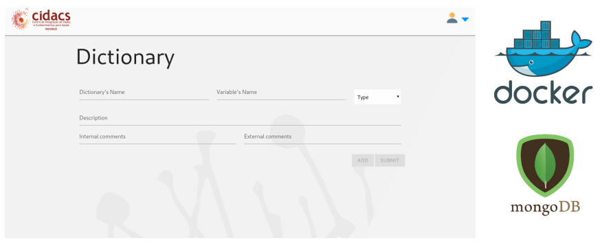
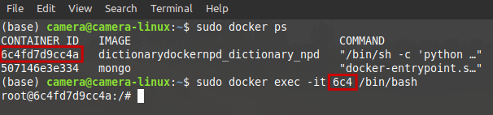
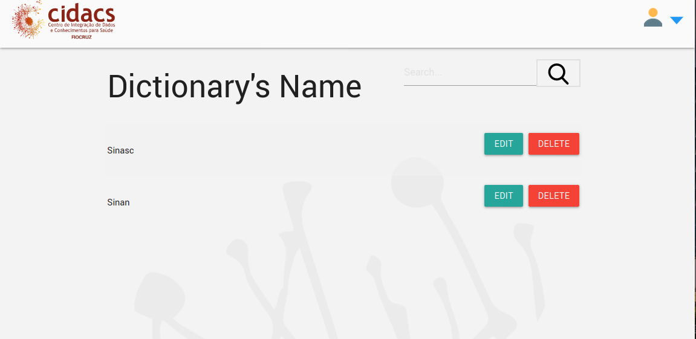

# Dictionary App (Docker dev environment)

<p align="center">
  
</p>

This project aims to deploy the application [Dictionary](https://github.com/cidacslab/dictionary-npd), from [CIDACS](https://cidacs.bahia.fiocruz.br/), in a Docker environment. The main objective is to create a developer environment for tests in a local network.

## Topology

This Docker application will start these two containers:

1. Application Dictionary (Python 2.7/Flask)
2. Mongodb database

## Requisites

### Docker:
- Docker: Version: 20.10.6 / API version: 1.41 / Go version: go1.13.15
- Docker-compose: Version 1.25.0 / docker-py version: 4.1.0 / CPython version: 3.8.5

You will have to install the Docker and the Docker-compose, but it doesn't need to be the exact version as above. Just in case of need.
If you are new in Docker applications, this website will help you:
  - Install Docker [https://docs.docker.com/engine/install/](https://docs.docker.com/engine/install/)
  - Install Docker-compose: [https://docs.docker.com/compose/install/](https://docs.docker.com/compose/install/)

### Dictionary Application:
- Python: 2.7
- Flask: 1.0.2
- Click: 7.0
- itsdangerous:1.1.0
- Jinja2: 2.10.1
- MarkupSafe: 1.1.1
- Werkzeug: 0.15.3
- pandas: 0.22.0
- pymongo: 3.8.0

These are the same requirements as the developer have used to build the application. None of them was changed. It isn't the purpose of this project, but a refactory is recommended, since the Python 2.7 is deprecate

## Running the environment with just one command:

```
$ sudo docker-compose up
```
That's all that you need! Just type it in your terminal! Make sure that you are inside the home path of this project.

The Docker will do all the harder tasks!

But, if you have changed any Dockerfiles after the first running, maybe you should run this one:

```
$ sudo docker-compose up --build
```
This command ensures that all the image will be built from the changes already done.


## How to use the application?
```
http://0.0.0.0:5000
```
Simple as it should be!

## Inside the container
If you want to have the full access to the application container, with a bash shell, just follow these steps:

1. Open a new terminal.
2. Type the command below to know the ID of the container.
```
$ sudo docker ps
```
3. With the ID, the command below will give you access to a shell inside the container (6c4fd7d9cc4a is an example of ID):
```
$ sudo docker exec -it 6c4 /bin/bash
```


## More environment tips
- All content of the directory /dictionary_npd is mirrored (bind volume) with the same directory inside the container.
- All the files from the database mongodb (/data/db) are mirrored with the directory (/database) in the application home path. Even if the container is stopped, the files will be persist in this folder.
- All .csv files generated by the application will be save in the directory /files.

## Using the Dictionary Application

The dictionary has some functions:
  - Adds a new dictionary
  - Lists the existing dictionaries
  - Lists the variables from a dictionary
  - Exports the dictionary to .csv format
  - Prints the dictionary to .pdf format

### Adding a new dictionary

<p align="center">
  
</p>

This is the home page of the application. Here you be able to create a new dictionary.
1. Dictionary's Name (mandatory): name of the dictionary.
2. Variable's name (mandatory): name of the variable.
3. Type (mandatory): Define the type of the variable, based in the following types:
    - Byte
      - Category's Name
      - Original Value
      - Standardized Value
    - Date
    - Integer
    - Long
    - String
    - Double
    ```
    Note: You don't need to include the values: "0-Nulo" and "99-Inconsistência".
    ```
4. Description (highly recommended): Description about the variable.
5. Internal Comments (optional): Internal comments that will not be in the dictionary of the researchers.
6. External Comments (optional): External comments that will be in the dictionary of the researchers.
7. Add: Adds the variable to dictionary (save cache).
8. Submit: Creates the dictionary and add dictionary variables to the database.

    ```
    Note: You can add as much variable as necessary. 
    ```

### Listing the Dictionaries early saved

<p align="center">
  
</p>

Lists all the dictionaries included in the database.

- Edit: Open a list of variables of the dictionary for viewing and editing.
- Delete: Deletes the dictionary from the database.

### List of Variables

<p align="center">
  
</p>

Shows a preview of the variables contained in the dictionary.

- Edit: Edits a variable
- Delete: Deletes a variable from the database.
- Print Dictionary CSV: Creates a dictionary version for the researcher in CSV.
- Print Dictionary PDF: Creates a dictionary version for the researcher in PDF.
- Add Variable: Adds a new variable in the dictionary.

### Example of Dictionary in PDF

<p align="center">
  
</p>


### Example of use

<p align="center">
  
</p>
